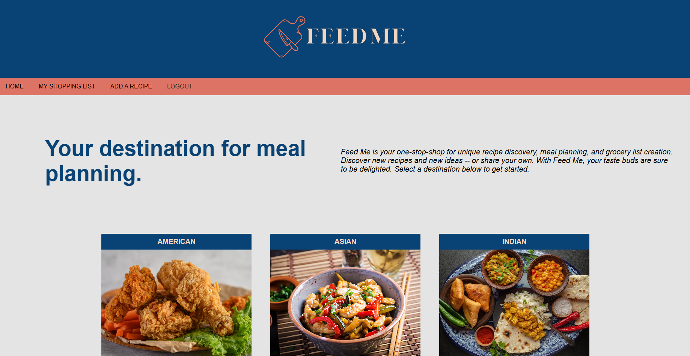

# feed-me-recipe-app

## Description
Feed Me is your one-stop-shop for unique recipe discovery, meal planning, and recipe storage. Whether you're tired from the workday or tired of trying to decide what to make for dinner, Feed Me can help make meal planning easy and fun. 

The application can be viewed at: https://[heroku url]

## Installation

N/A

## Usage

Discover new recipes from a variety of cuisines. Login or sign-up and select your destination of choice for recipe ideas. Not sure what you want to eat? Click the "you feed me" button to receive a random recipe suggestion. Click into a recipe further to see ingredients and instructions needed to create the meal on your own. Feed Me also gives you a place to store your own recipes, so you can easily find all of your meal planning ideas in one spot. 

## License

Please refer to the LICENSE listed in the repository. 

## Collaborators

Teammates Jack Peterson, Jamie Holpuch, and Heath Dill were all contributers to this project. 
Instructor Eric Sayez and TA Jeremy offered support throughout the project.  

## Resources and Assistance Credit
[API](https://spoonacular.com/) 
[Logo Design](https://canva.com) 
[Inspiration](https://whatsfordinner.com/) 
[Images](https://www.freepik.com/photos/food) 